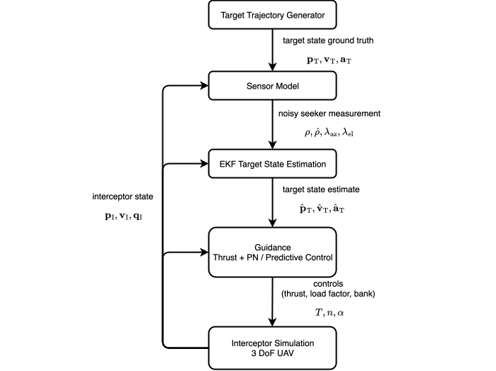
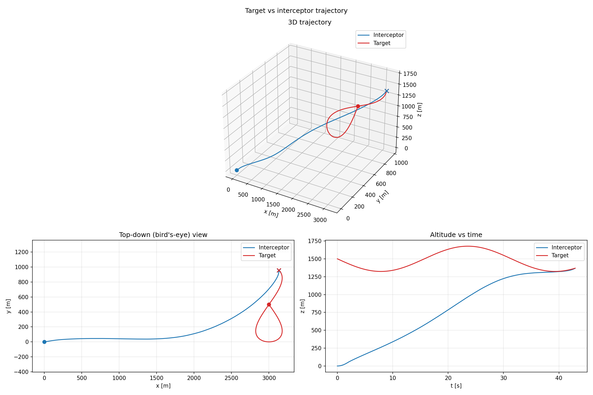
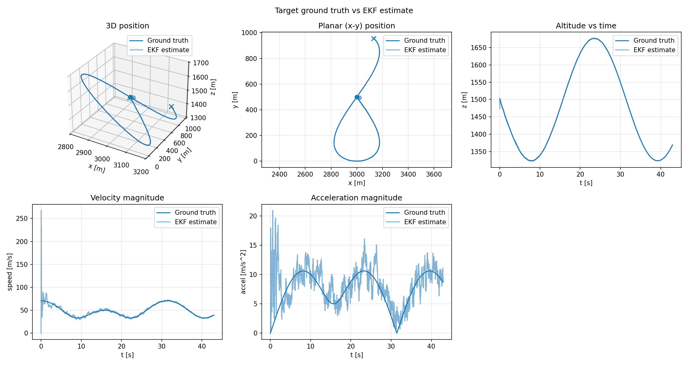
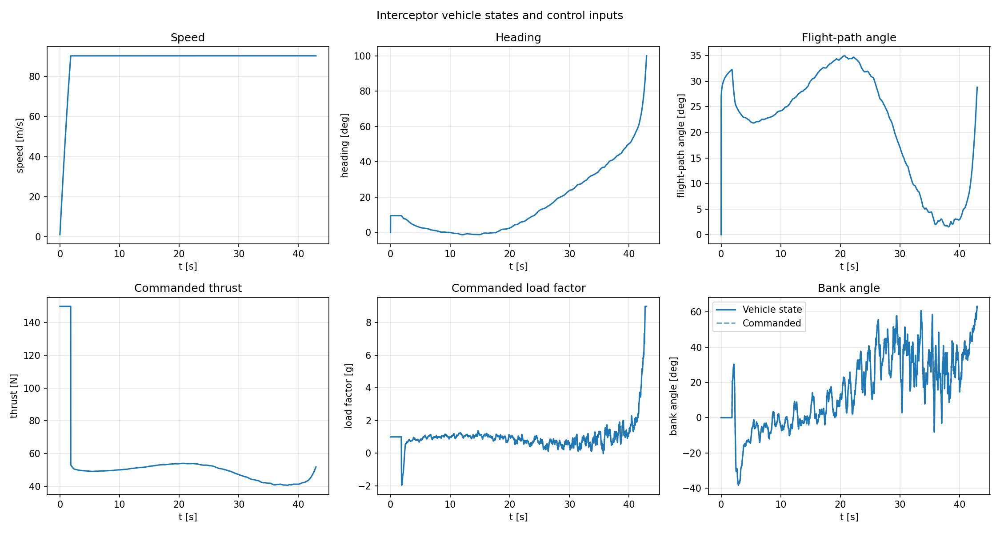

# GNC Interceptor

A modern C++ project for exploring guidance, navigation, and control (GNC) in a simulated 3D interception scenario. A point-mass interceptor follows a moving target using proportional navigation (PN) or predictive guidance based on iterative Linear Quadratic Regulator (iLQR) optimization.

The code separates vehicle simulation, target trajectories, sensor modeling, state estimation, and guidance into reusable libraries. 

## Architecture



A detailed description of each component is to be found in the [docs](docs/).

## Components

| Component | Implementation |
| --- | --- |
| [Simulation](docs/simulation.md) | 3DOF point-mass dynamics actuated with thrust, load factor and bank commands considering state and control limits. The standalone example uses RK4 integration. |
| [Target Trajectory Generator](docs/target_trajectory_generator.md) | Deterministic constant-velocity, circular, figure-eight, and helical trajectories, including position, velocity, and acceleration. |
| [PN guidance](docs/guidance.md) | Proportional Navigation (PN) based acceleration commands, control allocation into load factor and bank angle, and a separate boost/trim thrust law. |
| [Predictive guidance](docs/guidance.md) | Receding-horizon iLQR optimization of load factor and bank angle, with bounded controls and an adaptive horizon. Thrust is handled separately using the same boost/trim approach as the PN controller. |
| [Sensor model](docs/sensor_modeling.md) | Simulates a body-fixed radar seeker sensor providing range, range-rate, azimuth, and elevation measurements with Gaussian noise. |
| [Target estimation](docs/target_state_estimation.md) | Nine-state Extended Kalman Filter (EKF) for position, velocity, and acceleration, using a constant-acceleration model with white-noise jerk. |

The simulator's internal state is `[x, y, z, speed, heading, flight_path_angle]`; its control input is `[thrust, load_factor, bank_angle]`. The inertial frame is **right-handed with z pointing up**.

Out-of-scope for this project: full rigid-body 6DOF dynamics and low-level attitude control are outside its scope. Aerodynamic effects are neglected, only a simple drag model is used in simulation. The interceptor state is assumed to be perfectly known. Sensor model is unbiased.

## Example 

The target performs a figure-eight maneuver in a tilted plane. The interceptor starts at the origin with an initial boost-phase and the iLQR-based predictive guidance is used to intercept the target, with target states estimated by the EKF from noisy radar measurements. The plots show the trajectories, estimation performance, and interceptor states and controls.







## Build

Prerequisites:

- A C++20 compiler and a native build tool such as Make or Ninja.
- **CMake 3.23 or newer**.
- **Eigen 3.4 or newer**, discoverable as `Eigen3` by CMake.
- **ilqr-cpp**, the iLQR library, auto-fetched by CMake.
- **autodiff**, installed with its CMake package and `autodiff::autodiff` target. Predictive guidance requires it; it is not fetched automatically.

From the repository root:

```sh
cmake -S . -B build -DCMAKE_BUILD_TYPE=RelWithDebInfo
cmake --build build --target standalone 
```


## Run the simulation

Run from the repository root:

```sh
mkdir -p standalone/outputs
./build/standalone/standalone
```

## Plot results

The plotting script requires Python 3.9 or newer, NumPy, pandas, and Matplotlib:

```sh
python3 -m pip install -r standalone/visualization/requirements.txt
python3 standalone/visualization/plot_trajectory.py standalone/outputs/standalone_trajectory.csv
```

## Repository layout

```text
docs/media/                       Architecture diagram and example plots
libs/
  math/                           Shared states, angles, concepts, integrators
  simulation/                     Vehicle dynamics and templated simulator
  target_trajectory_generator/     Analytic target maneuvers
  guidance/
    common/                       Controller concept and thrust control
    pn_control/                   PN and transverse control allocation
    predictive_control/           iLQR controller, dynamics, and cost terms
  sensor_model/                   Radar measurements and Gaussian noise
  target_state_estimation/         Extended Kalman Filter
standalone/
  main.cpp                        Simulation entry point and scenario settings
  csv_logger.hpp                  Run logging
  visualization/                  Python analysis tools
ros2/
  gnc_core/                       Build and export the C++ libraries
  gnc_interfaces/                 Message and service definitions
  gnc_ros/                        Simulation, estimation, and guidance nodes
  gnc_bringup/                    Launch, parameters, and RViz configuration
```
